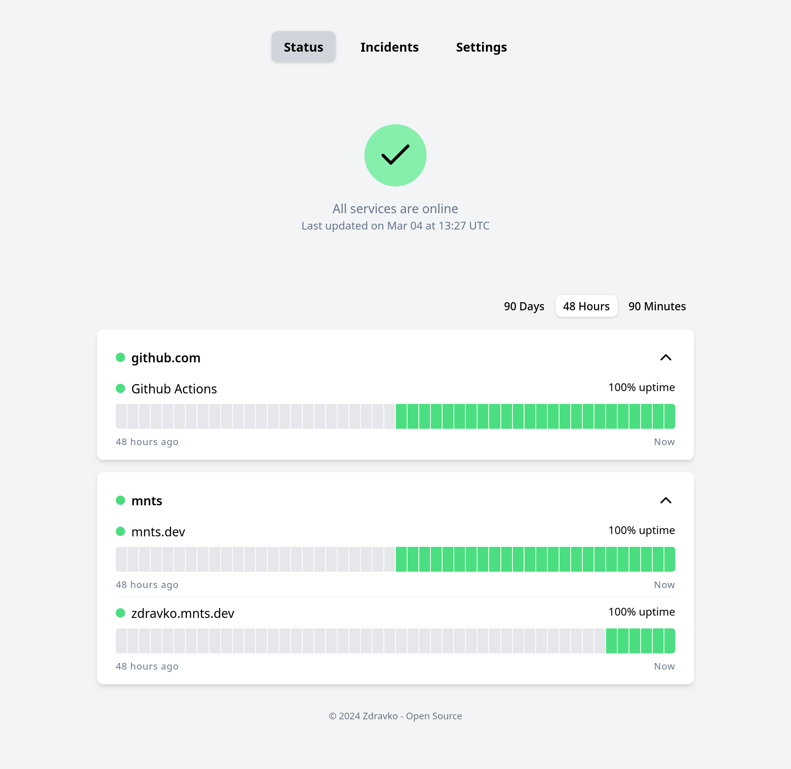

# `zdravko`

Golang selfhosted Status/Healthcheck monitoring app.

Mostly just a project to test [temporal.io](https://temporal.io/).

### Roadmap
 - [x] SSO Support for authentication.
 - [x] SQLite for database.
    - This means for main app db as well as temporal db.
 - [x] Single binary.
    - One binary to run worker, server and temporal all together.
 - [ ] Abbility for multiple workers.
    - Spread workers across regions to monitor latency from different locations.
 - [ ] HTTP Healthchecks.
 - [ ] TCP Healthchecks.
 - [ ] CronJob Healthchecks (via webhooks).


Demo is available at https://zdravko.mnts.dev.

# Development

### Dependencies
 * [devbox](https://www.jetpack.io/devbox)
 * [justfile](https://github.com/casey/just) (optional, `devbox run -- just` can be used instead)

```sh
# Configure
cp example.env .env

# Generate JWT key
just generate-jwt-key

# Start development environment
just run
```

### License
Under AGPL, see [LICENSE](LICENSE) file.
