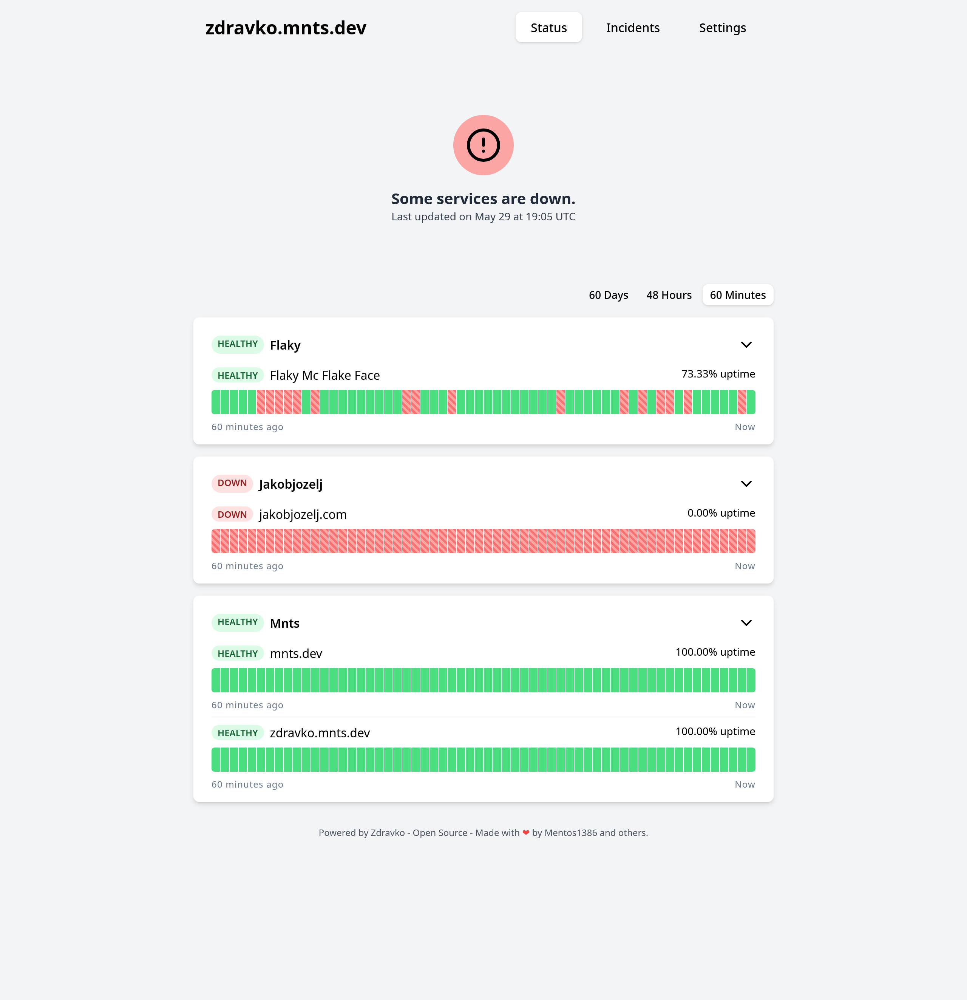

# `zdravko`

Golang selfhosted Status/Healthcheck monitoring app.

### Roadmap
 - [x] SSO Support for authentication.
 - [x] SQLite for database.
    - This means for main app db as well as temporal db.
 - [x] Single binary.
    - One binary to run worker, server and temporal all together.
 - [x] Abbility for multiple workers.
    - Spread workers across regions to monitor latency from different locations.
 - [x] Use [k6](https://github.com/grafana/k6) for checks, so that they can be written in javascript.
 - [x] History and working home page.
    - Kinda working atm. ~But look if all the data could be stored/fetched from temporal.~
 - [x] Edit/Delete operations for healthchecks and workers.
 - [ ] CronJob Healthchecks (via webhooks).
    - Allow CronJob monitoring by checking that there was an event at expected time.
    - Allow Heartbeat monitoring to alert when events stop coming.
    - Allow integration with other services by alerting/transforming when events come.
 - [ ] Notifications (webhooks, slack, etc).
 - [ ] Incidents (based on script that is triggered by monitors/crobjobs).
 - [ ] Prepare i18n.
 - [ ] Alpha Version (3Q 2024)
 - [ ] ??
 - [ ] Beta Version (4Q 2024)
 - [ ] ??
 - [ ] Stable Release (1H 2025)


Demo is available at https://zdravko.mnts.dev. More screenshots in the [docs folder](docs/).

# Development

### Dependencies
 * [devbox](https://www.jetify.com/devbox)
 * [justfile](https://github.com/casey/just) (optional, `devbox run -- just` can be used instead)

```sh
# Configure
# You will need to configure an SSO provider
# This can be github for example:.
cp example.env .env

# Generate JWT key
just generate-jwt-key

# Start development environment
just run

# Or build binaries
just build-bin
# Or docker image (for current platform)
just build-docker
```

### License
Under AGPL, see [LICENSE](LICENSE) file.
